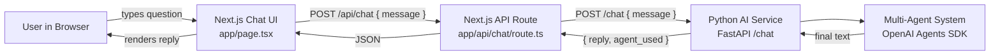
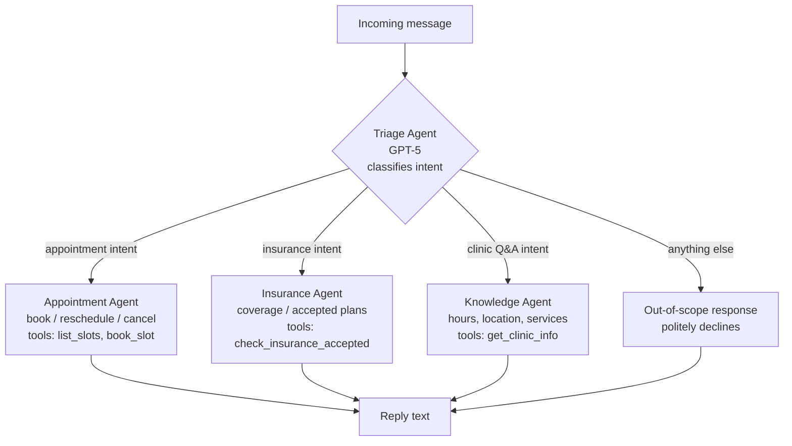

# Insight Healthcare Chatbot

A simple multi-agent clinic chatbot. Patients type a natural-language question and get a text answer scoped to **appointments**, **insurance checks**, or **clinic knowledge**.

- **Frontend + thin API**: Next.js (TypeScript, App Router)
- **AI service**: Python (FastAPI) using the **OpenAI Agents SDK** with **GPT-5**
- **Architecture**: a single Triage (head) agent that hands off to one of three scoped sub-agents
- **Deploy target**: k3s pod, live at `https://clinic.callsphere.site` (DNS via Hostinger)

> Scope is intentionally narrow. Each sub-agent refuses out-of-scope questions and tells the user what it *can* help with.

---

## 1. Application workflow

End-to-end request flow from browser to AI service and back.



**Why a Next.js API route in front of FastAPI?**
Keeps the OpenAI key and AI service URL server-side only, gives one origin for the browser, and makes future auth / rate-limit / logging easy to add without touching Python.

---

## 2. AI service workflow (multi-agent)

How the **Triage agent** routes a question to one of three scoped specialists using the OpenAI Agents SDK `handoffs` feature.



### Agent responsibilities (SOLID — single responsibility per agent)

| Agent              | Owns                                                     | Refuses                                   |
| ------------------ | -------------------------------------------------------- | ----------------------------------------- |
| **Triage**         | Intent classification + handoff. Never answers directly. | Anything content-shaped.                  |
| **Appointment**    | Slot listing, booking, cancellation, rescheduling.       | Medical advice, insurance, generic chat.  |
| **Insurance**      | "Do you accept X?", coverage of accepted plans.          | Diagnoses, booking, billing disputes.     |
| **Knowledge**      | Clinic hours, address, contact, services offered.        | Anything not about *this* clinic.         |

---

## 3. Folder structure

```
insight_healthcare/
├── frontend/                    # Next.js (TS, App Router)
│   ├── app/
│   │   ├── page.tsx             # Chat UI
│   │   ├── layout.tsx
│   │   └── api/chat/route.ts    # Proxy to Python service
│   ├── components/
│   │   ├── ChatWindow.tsx
│   │   ├── MessageList.tsx
│   │   └── MessageInput.tsx
│   ├── lib/
│   │   └── chatClient.ts        # fetch wrapper (single responsibility)
│   ├── package.json
│   ├── next.config.mjs
│   └── tsconfig.json
│
├── ai-service/                  # Python FastAPI
│   ├── app/
│   │   ├── main.py              # FastAPI app + /chat endpoint
│   │   ├── core/
│   │   │   ├── config.py        # Settings (pydantic-settings) — DIP
│   │   │   └── logging.py
│   │   ├── agents/
│   │   │   ├── triage.py        # Head agent w/ handoffs
│   │   │   ├── appointment.py
│   │   │   ├── insurance.py
│   │   │   ├── knowledge.py
│   │   │   └── tools.py         # @function_tool definitions
│   │   ├── schemas/
│   │   │   └── chat.py          # Pydantic req/resp models
│   │   └── services/
│   │       └── chat_service.py  # Orchestrates Runner.run(...) — OCP
│   ├── tests/
│   ├── requirements.txt
│   └── pyproject.toml
│
├── k8s/                         # k3s manifests
│   ├── namespace.yaml
│   ├── ai-service.deployment.yaml
│   ├── ai-service.service.yaml
│   ├── frontend.deployment.yaml
│   ├── frontend.service.yaml
│   ├── ingress.yaml             # clinic.callsphere.site
│   └── secrets.example.yaml     # template, real secret applied manually
│
├── .gitignore
└── README.md
```

### SOLID mapping

- **S — Single Responsibility**: each agent file owns *one* intent; each React component owns *one* UI concern.
- **O — Open/Closed**: new specialists are added by creating a new file in `agents/` and registering it in `triage.py`'s handoff list. No existing agent changes.
- **L — Liskov**: every agent is an `agents.Agent` instance; the `Runner` treats them uniformly.
- **I — Interface Segregation**: tools are split per agent (`tools.py` exports small focused functions), no agent imports tools it doesn't use.
- **D — Dependency Inversion**: `chat_service.py` depends on a `RunnerProtocol`-shaped abstraction so the SDK can be swapped/mocked in tests; settings injected via `core/config.py`.

---

## 4. Local development

### Prereqs
- Node.js ≥ 20
- Python ≥ 3.11
- An `OPENAI_API_KEY` with access to `gpt-5`

### AI service
```bash
cd ai-service
python -m venv .venv && source .venv/bin/activate
pip install -r requirements.txt
export OPENAI_API_KEY=sk-...
uvicorn app.main:app --reload --port 8000
```

### Frontend
```bash
cd frontend
npm install
echo "AI_SERVICE_URL=http://localhost:8000" > .env.local
npm run dev
# open http://localhost:3000
```

---

## 5. Deployment (k3s → clinic.callsphere.site)

1. Build images (or use hostPath mount pattern like other CallSphere apps).
2. `kubectl apply -f k8s/namespace.yaml`
3. Create the secret with the real OpenAI key:
   ```bash
   kubectl create secret generic insight-app-secrets \
     -n insight-healthcare \
     --from-literal=OPENAI_API_KEY=sk-...
   ```
4. `kubectl apply -f k8s/`
5. Point `clinic.callsphere.site` → cluster IP via the Hostinger DNS API (token already in CallSphere credential set).
6. Verify: `curl https://clinic.callsphere.site/api/health`

---

## 6. Roadmap

- [x] Plan + flowchart
- [ ] Scaffold Next.js frontend
- [ ] Scaffold FastAPI AI service
- [ ] Implement Triage + 3 sub-agents (OpenAI Agents SDK, GPT-5)
- [ ] Wire frontend → Next.js API → Python service
- [ ] k3s manifests
- [ ] DNS via Hostinger → `clinic.callsphere.site`
- [ ] Smoke test in browser

---

## 7. Non-goals (for v1)

- No login / patient identity (anonymous chat only).
- No real EHR / scheduling integration — appointment + insurance tools return **stubbed** clinic data so the agent flow is demonstrable end-to-end. Real integrations are a follow-up.
- No chat history persistence (stateless per request).
- No streaming responses (plain JSON reply for simplicity; can upgrade to SSE later).
