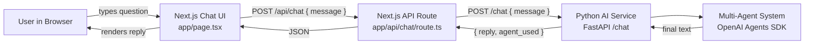
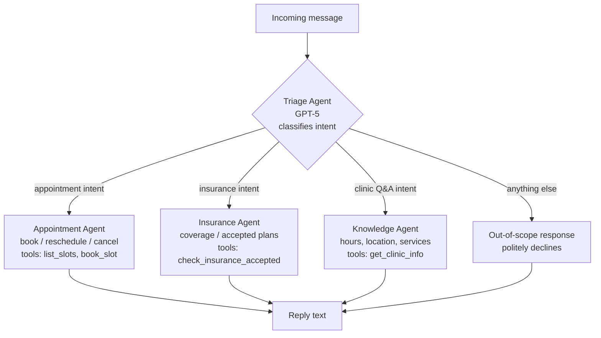
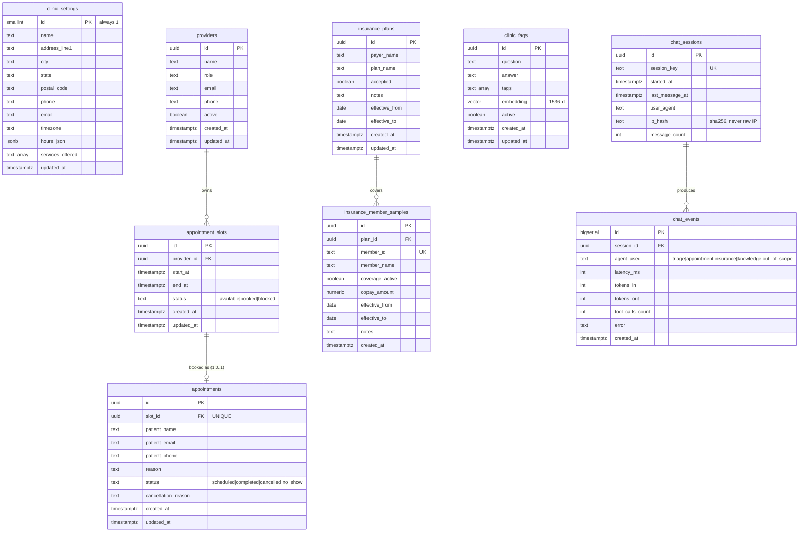

# Insight Healthcare Chatbot

A simple multi-agent clinic chatbot. Patients type a natural-language question and get a text answer scoped to **appointments**, **insurance checks**, or **clinic knowledge**.

- **Frontend + thin API**: Next.js (TypeScript, App Router)
- **AI service**: Python (FastAPI) using the **OpenAI Agents SDK** with **GPT-5**
- **Architecture**: a single Triage (head) agent that hands off to one of three scoped sub-agents
- **Deploy target**: k3s pod, live at `https://clinic.callsphere.site` (DNS via Hostinger)

> Scope is intentionally narrow. Each sub-agent refuses out-of-scope questions and tells the user what it *can* help with.

---

## 1. Application workflow

End-to-end request flow from browser to AI service and back.



**Why a Next.js API route in front of FastAPI?**
Keeps the OpenAI key and AI service URL server-side only, gives one origin for the browser, and makes future auth / rate-limit / logging easy to add without touching Python.

---

## 2. AI service workflow (multi-agent)

How the **Triage agent** routes a question to one of three scoped specialists using the OpenAI Agents SDK `handoffs` feature.



### Agent responsibilities (SOLID — single responsibility per agent)

| Agent              | Owns                                                     | Refuses                                   |
| ------------------ | -------------------------------------------------------- | ----------------------------------------- |
| **Triage**         | Intent classification + handoff. Never answers directly. | Anything content-shaped.                  |
| **Appointment**    | Slot listing, booking, cancellation, rescheduling.       | Medical advice, insurance, generic chat.  |
| **Insurance**      | "Do you accept X?", coverage of accepted plans.          | Diagnoses, booking, billing disputes.     |
| **Knowledge**      | Clinic hours, address, contact, services offered.        | Anything not about *this* clinic.         |

---

## 3. Folder structure

```
insight_healthcare/
├── frontend/                    # Next.js (TS, App Router)
│   ├── app/
│   │   ├── page.tsx             # Chat UI
│   │   ├── layout.tsx
│   │   └── api/chat/route.ts    # Proxy to Python service
│   ├── components/
│   │   ├── ChatWindow.tsx
│   │   ├── MessageList.tsx
│   │   └── MessageInput.tsx
│   ├── lib/
│   │   └── chatClient.ts        # fetch wrapper (single responsibility)
│   ├── package.json
│   ├── next.config.mjs
│   └── tsconfig.json
│
├── ai-service/                  # Python FastAPI
│   ├── app/
│   │   ├── main.py              # FastAPI app + /chat endpoint
│   │   ├── core/
│   │   │   ├── config.py        # Settings (pydantic-settings) — DIP
│   │   │   ├── db.py            # SQLAlchemy async engine + session
│   │   │   └── logging.py
│   │   ├── models/              # SQLAlchemy ORM models (one file per table)
│   │   │   ├── clinic.py
│   │   │   ├── provider.py
│   │   │   ├── appointment.py
│   │   │   ├── insurance.py
│   │   │   ├── faq.py
│   │   │   └── chat.py
│   │   ├── repositories/        # DB access layer — DIP: agents depend on these, not raw SQL
│   │   │   ├── slot_repo.py
│   │   │   ├── appointment_repo.py
│   │   │   ├── insurance_repo.py
│   │   │   ├── faq_repo.py
│   │   │   └── chat_repo.py
│   │   ├── agents/
│   │   │   ├── triage.py        # Head agent w/ handoffs
│   │   │   ├── appointment.py
│   │   │   ├── insurance.py
│   │   │   ├── knowledge.py
│   │   │   └── tools.py         # @function_tool definitions
│   │   ├── schemas/
│   │   │   └── chat.py          # Pydantic req/resp models
│   │   └── services/
│   │       ├── chat_service.py  # Orchestrates Runner.run(...) — OCP
│   │       └── embedding_service.py # OpenAI embeddings for FAQ ingestion
│   ├── alembic/                 # Migrations
│   │   ├── env.py
│   │   └── versions/
│   ├── scripts/
│   │   ├── seed_clinic.py       # Insert clinic_settings + insurance + FAQs
│   │   └── embed_faqs.py        # Backfill FAQ embeddings via OpenAI
│   ├── tests/
│   ├── alembic.ini
│   ├── requirements.txt
│   └── pyproject.toml
│
├── k8s/                         # k3s manifests
│   ├── namespace.yaml
│   ├── ai-service.deployment.yaml
│   ├── ai-service.service.yaml
│   ├── frontend.deployment.yaml
│   ├── frontend.service.yaml
│   ├── ingress.yaml             # clinic.callsphere.site
│   └── secrets.example.yaml     # template, real secret applied manually
│
├── .gitignore
└── README.md
```

### SOLID mapping

- **S — Single Responsibility**: each agent file owns *one* intent; each React component owns *one* UI concern.
- **O — Open/Closed**: new specialists are added by creating a new file in `agents/` and registering it in `triage.py`'s handoff list. No existing agent changes.
- **L — Liskov**: every agent is an `agents.Agent` instance; the `Runner` treats them uniformly.
- **I — Interface Segregation**: tools are split per agent (`tools.py` exports small focused functions), no agent imports tools it doesn't use.
- **D — Dependency Inversion**: `chat_service.py` depends on a `RunnerProtocol`-shaped abstraction so the SDK can be swapped/mocked in tests; settings injected via `core/config.py`.

---

## 4. Local development

### Prereqs
- Node.js ≥ 20
- Python ≥ 3.11
- An `OPENAI_API_KEY` with access to `gpt-5`
- Postgres ≥ 14 with `pgcrypto` + `pgvector` extensions available (central VM at `72.62.162.83`, logical DB `insight_healthcare`)

### AI service
```bash
cd ai-service
python -m venv .venv && source .venv/bin/activate
pip install -r requirements.txt
export OPENAI_API_KEY=sk-...
export DATABASE_URL=postgresql+asyncpg://postgres:<pw>@72.62.162.83:5432/insight_healthcare
alembic upgrade head                 # create tables + extensions
python -m scripts.seed_clinic        # one-time seed of clinic info + insurance + FAQs
python -m scripts.embed_faqs         # generate pgvector embeddings for FAQs
uvicorn app.main:app --reload --port 8000
```

### Frontend
```bash
cd frontend
npm install
echo "AI_SERVICE_URL=http://localhost:8000" > .env.local
npm run dev
# open http://localhost:3000
```

---

## 5. Deployment (k3s → clinic.callsphere.site)

1. Build images (or use hostPath mount pattern like other CallSphere apps).
2. `kubectl apply -f k8s/namespace.yaml`
3. Create the secret with the real OpenAI key + Postgres URL:
   ```bash
   kubectl create secret generic insight-app-secrets \
     -n insight-healthcare \
     --from-literal=OPENAI_API_KEY=sk-... \
     --from-literal=DATABASE_URL=postgresql+asyncpg://postgres:<pw>@72.62.162.83:5432/insight_healthcare
   ```
4. `kubectl apply -f k8s/`
5. Run migrations once the pod is up:
   ```bash
   kubectl exec -n insight-healthcare deploy/insight-ai -- alembic upgrade head
   kubectl exec -n insight-healthcare deploy/insight-ai -- python -m scripts.seed_clinic
   kubectl exec -n insight-healthcare deploy/insight-ai -- python -m scripts.embed_faqs
   ```
6. Point `clinic.callsphere.site` → cluster IP via the Hostinger DNS API (token already in CallSphere credential set).
7. Verify: `curl https://clinic.callsphere.site/api/health`

---

## 6. Roadmap

- [x] Plan + flowchart
- [x] DB schema + ERD
- [x] Create logical DB `insight_healthcare` on central Postgres, enable `pgcrypto` + `vector`
- [x] Scaffold FastAPI AI service (models, repositories, agents, tools)
- [x] Alembic `001_init` migration + seed scripts
- [x] Scaffold Next.js frontend
- [x] Implement Triage + 3 sub-agents (OpenAI Agents SDK, GPT-5)
- [x] Wire frontend → Next.js API → Python service
- [x] k3s manifests + `insight-app-secrets` (hostPath pattern, no image build needed)
- [x] DNS via Hostinger → `clinic.callsphere.site`
- [x] Smoke test (all 4 agent paths + analytics + TLS) — **LIVE 2026-05-20** ✅

---

## 7. Non-goals (for v1)

- No login / patient identity for browsing — patient name/email/phone are captured *only* on the `appointments` row when a booking is actually confirmed.
- No real EHR integration — appointments live in our own Postgres tables (a clinic admin tool can read them later).
- **No chat content stored.** `chat_events` records which agent answered + latency + token counts, never the message text (privacy by design).
- No streaming responses (plain JSON reply for simplicity; can upgrade to SSE later).

---

## 8. Database schema (Postgres)

- **Host**: `72.62.162.83` (central CallSphere Postgres VM — one host, one logical DB per app)
- **Logical DB**: `insight_healthcare` (new, isolated)
- **Extensions**: `pgcrypto` (for `gen_random_uuid()`), `vector` (pgvector — semantic FAQ retrieval)
- **Migrations**: Alembic, run from the `ai-service` container (`alembic upgrade head`)
- **Credentials**: injected into the pod via k3s Secret `insight-app-secrets` (`secretKeyRef`) — never inline in YAML, per the CallSphere k3s pattern.

### 8.1 ERD



### 8.2 Table summary

| Table | Purpose | Primary access pattern |
|---|---|---|
| `clinic_settings` | Single-row config: name, address, hours, services. CHECK (id = 1). | Read by Knowledge agent + frontend footer. |
| `providers` | Doctors / practitioners taking appointments. | Read by Appointment agent. |
| `appointment_slots` | Pre-generated bookable windows per provider. | List available (status='available' AND start_at>now); update on book. |
| `appointments` | Confirmed bookings. `slot_id UNIQUE` prevents double-book at DB level. | Insert on confirm; read by future admin view. |
| `insurance_plans` | Accepted (or explicitly not accepted) payers/plans + effective dates. | Case-insensitive lookup by payer_name. |
| `insurance_member_samples` | **Demo only** — sample member IDs the Insurance agent can "verify" so the chatbot has real-looking responses out of the box. | Lookup by member_id. |
| `clinic_faqs` | Knowledge base w/ 1536-d embeddings for semantic search. | `ORDER BY embedding <=> query_embedding LIMIT 5` from Knowledge agent. |
| `chat_sessions` | Anonymous session tracking via cookie token. **No content.** | Upsert on each request. |
| `chat_events` | Per-turn analytics. **No content stored.** | Insert on every agent reply; rollups by `created_at`. |

### 8.3 Design notes

- **No chat content stored** (per spec): `chat_events` keeps *which agent answered* + *latency* + *tokens*, but never `message.content`. Privacy-friendly for clinic context.
- **Single-row `clinic_settings`** uses `CHECK (id = 1)` — gives one canonical config row without inventing a `clinics` table for a single-tenant app. If we ever go multi-clinic, this becomes a real `clinics` table and FKs get added everywhere.
- **Slot model** keeps availability explicit and queryable; `appointments.slot_id UNIQUE` is the strongest guarantee against double-booking.
- **pgvector**: FAQ embeddings are 1536-d (OpenAI `text-embedding-3-small`). Index: `ivfflat (embedding vector_cosine_ops)`. Embeddings are generated at admin write-time (`scripts/embed_faqs.py`), not at chat query-time — only the *query* gets embedded per request.
- **Patient PII** is created only when a booking is confirmed. Anonymous browsing creates no patient row anywhere.
- **`ip_hash`** stores SHA-256 of the client IP, never the raw IP — gives "unique visitors" analytics without storing identifiers.

### 8.4 Indexes

| Index | Purpose |
|---|---|
| `appointment_slots (status, start_at)` | "Next available slots" listing. |
| `appointment_slots (provider_id, start_at)` | Per-provider schedule. |
| `appointments (slot_id) UNIQUE` | Prevent double-book at DB layer. |
| `insurance_plans (lower(payer_name))` | Case-insensitive payer match. |
| `clinic_faqs USING ivfflat (embedding vector_cosine_ops)` | Semantic FAQ retrieval. |
| `chat_events (session_id, created_at)` | Per-session timeline. |
| `chat_events (created_at)` | Daily analytics rollups. |

### 8.5 Migration plan (Alembic)

| Revision | Contents |
|---|---|
| `001_init` | `CREATE EXTENSION pgcrypto, vector;` + all 9 tables + indexes |
| `002_seed_static` | Singleton `clinic_settings`, 3 providers, 1 `insurance_plans` row, 3 `insurance_member_samples`, 15 `clinic_faqs` rows (without embeddings) |
| `003_generate_slots` | Generates ~420 `appointment_slots` for the next 14 weekdays (relative to migration run-time), blocks 12:00–13:00 lunch, flips 3 sample slots to `'booked'` and inserts matching `appointments` rows |

A post-migration script `scripts/embed_faqs.py` fills `clinic_faqs.embedding` via OpenAI `text-embedding-3-small` once `OPENAI_API_KEY` is available in the pod env.

### 8.6 How the agents touch the DB

| Agent | Reads | Writes |
|---|---|---|
| Triage | — | — (pure routing) |
| Appointment | `providers`, `appointment_slots` | `appointments` (insert), `appointment_slots.status` (update to 'booked' / 'available' on cancel) |
| Insurance | `insurance_plans`, `insurance_member_samples` | — |
| Knowledge | `clinic_settings`, `clinic_faqs` (vector search) | — |
| *(chat_service)* | `chat_sessions` (upsert) | `chat_sessions`, `chat_events` (analytics) |

---

## 8.7 Sample seed data

Every table that needs starter content has a deterministic seed so the bot can actually answer real-sounding questions from minute one. Loaded by `python -m scripts.seed_clinic` after `alembic upgrade head`.

### clinic_settings (1 row — singleton)

| Field | Value |
|---|---|
| name | Insight Healthcare Clinic |
| address_line1 | 123 Wellness Way, Suite 200 |
| city / state / postal | Springfield, IL 62701 |
| phone | (555) 555-0100 |
| email | hello@insighthealth.example |
| timezone | America/Chicago |
| hours_json | Mon–Fri 09:00–17:00, Sat/Sun closed |
| services_offered | Annual physicals, Sick visits, Immunizations, Chronic disease management, Wellness screenings, Telehealth, Basic lab work |

### providers (3 rows — single specialty: Family Medicine)

| name | role | email | active |
|---|---|---|---|
| Dr. Sarah Chen | Family Medicine | s.chen@insighthealth.example | true |
| Dr. Marcus Thompson | Family Medicine | m.thompson@insighthealth.example | true |
| Dr. Priya Patel | Family Medicine | p.patel@insighthealth.example | true |

### appointment_slots (~420 rows total)

Generator rule (run by seed script):
- For each of 3 providers
- For each of the next 14 calendar days (skip Sat/Sun)
- 30-minute slots from **09:00–17:00**
- Slots at **12:00–13:00** seeded as `status = 'blocked'` (lunch)
- All other future slots seeded as `status = 'available'`
- 3 specific slots flipped to `status = 'booked'` (see appointments below)

Approx 10 weekday days × 14 slots × 3 providers ≈ **420 rows**.

### appointments (3 sample bookings — to show "booked" state)

| slot | patient_name | patient_email | reason | status |
|---|---|---|---|---|
| Dr. Chen, **tomorrow 10:00** | John Doe | john.doe@example.com | Annual physical | scheduled |
| Dr. Thompson, **day-after-tomorrow 14:00** | Jane Smith | jane.smith@example.com | Diabetes follow-up | scheduled |
| Dr. Patel, **+5 days 11:30** | Bob Johnson | bob.j@example.com | Sore throat — sick visit | scheduled |

The matching `appointment_slots.status` flips to `'booked'`.

### insurance_plans (1 row — the one we accept)

| payer_name | plan_name | accepted | notes |
|---|---|---|---|
| Blue Cross Blue Shield | PPO | true | In-network. Most BCBS PPO plans accepted; bring card at first visit. |

### insurance_member_samples (3 rows — demo member IDs)

| plan | member_id | member_name | coverage_active | copay | notes |
|---|---|---|---|---|---|
| BCBS PPO | `BCBS-X10001` | John Doe | true | $25 | Standard PPO Gold |
| BCBS PPO | `BCBS-X10002` | Jane Smith | true | $40 | High-deductible PPO |
| BCBS PPO | `BCBS-X10003` | Bob Johnson | **false** | — | Coverage ended 2025-12-31 (expired) |

The Insurance agent's `verify_member_id(member_id)` tool reads this table — so a user can ask *"is BCBS-X10003 still covered?"* and get a real, deterministic answer.

### clinic_faqs (15 rows — embeddings generated by `scripts/embed_faqs.py`)

| # | Question | Answer (summary) |
|---|---|---|
| 1 | What are your hours? | Mon–Fri 9:00 AM – 5:00 PM. Closed Sat/Sun. |
| 2 | Where are you located? | 123 Wellness Way, Suite 200, Springfield, IL 62701. |
| 3 | Is parking available? | Free on-site lot, accessible spots near entrance. |
| 4 | What services do you offer? | Family medicine: physicals, sick visits, immunizations, chronic-disease management, wellness screenings. |
| 5 | Do you treat children? | Yes, ages 6 months and up. |
| 6 | Do you offer telehealth? | Yes, Mon–Fri 10 AM – 3 PM. |
| 7 | What insurance do you accept? | Blue Cross Blue Shield PPO. Other plans on a case-by-case basis. |
| 8 | How do I book an appointment? | Use this chatbot, or call (555) 555-0100. |
| 9 | How do I reschedule or cancel? | Through this chatbot, or call us — at least 24 h notice preferred. |
| 10 | What should I bring to my first visit? | Photo ID, insurance card, list of current medications, prior records if any. |
| 11 | What if I'm running late? | Please call. More than 15 min late may require rescheduling. |
| 12 | Do you do lab work on-site? | Yes — basic blood draws and urinalysis. |
| 13 | Can I see the same provider every time? | Yes — request your provider when booking. |
| 14 | How long is a typical visit? | 30 min routine, 45 min for new patients. |
| 15 | How do I get a prescription refill? | Have your pharmacy fax/e-request us; we respond within 24 business hours. |

### chat_sessions / chat_events (empty at seed time)

Populated at runtime as users chat. Seed leaves them empty.

### Determinism + idempotency

- Seed uses **fixed UUIDs** for providers and the clinic settings row so re-running `seed_clinic` is idempotent (`ON CONFLICT DO UPDATE`).
- Slot timestamps are computed relative to *seed-run date* — so the demo always has "tomorrow 10:00" as a real future slot, never a stale fixed date.
- FAQ embeddings are filled by a separate `scripts/embed_faqs.py` pass so the seed script itself doesn't need network access to OpenAI.

---

## 9. Live agent telemetry

Numbers below are a **real snapshot** of the live `chat_events` analytics table (taken **2026-05-20 ~23:43 UTC**, ~3 h after go-live). Re-run the SQL below to refresh.

### 9.1 Agent usage rollup (all-time across all sessions)

| Agent | Turns | Avg latency | In tokens | Out tokens | Tool calls |
|---|---:|---:|---:|---:|---:|
| **appointment** | 37 | 13.4 s | 177,468 | 20,680 | 21 |
| **out_of_scope** | 20 | 2.0 s | 4,927 | 1,435 | 0 |
| **insurance** | 13 | 9.1 s | 55,810 | 5,008 | 9 |
| **knowledge** | 12 | 9.9 s | 33,088 | 5,084 | 13 |
| **triage** | 11 | 2.9 s | 11,586 | 1,141 | 0 |

**Totals**: 93 turns · 46 unique sessions · 43 tool calls · 316,227 tokens

Observations:
- Appointment is by far the busiest specialist — matches the product's primary use case.
- `out_of_scope` + `triage` are both fast (~2–3s) and use no tools — they're short refusals or pure routing.
- Specialist agents that hit tools (appointment / insurance / knowledge) cluster around 9–13 s — dominated by the GPT-5 reasoning step, not the DB calls (tools themselves finish in 5–50 ms; see `tool_done latency_ms=` lines in pod stdout).

### 9.2 Last 10 turns (rolling)

| id | session | agent | tools | lat ms | in / out tok | UTC |
|---|---|---|---:|---:|---:|---|
| 93 | `8c43ebc0…` | knowledge | 1 | 8,199 | 3,935 / 417 | 23:43:01 |
| 92 | `8c43ebc0…` | insurance | 1 | 16,808 | 2,890 / 377 | 23:41:04 |
| 91 | `8c43ebc0…` | insurance | 0 | 4,029 | 1,542 / 219 | 23:40:47 |
| 90 | `8c43ebc0…` | triage | 0 | 1,262 | 822 / 90 | 23:40:32 |
| 89 | `final-e2e-17…` | appointment | 0 | 3,151 | 7,036 / 147 | 23:39:43 |
| 88 | `final-e2e-17…` | appointment | 1 | 5,584 | 9,669 / 246 | 23:39:37 |
| 87 | `final-e2e-17…` | appointment | 0 | 4,463 | 6,117 / 198 | 23:39:33 |
| 86 | `final-e2e-17…` | appointment | 1 | 9,720 | 5,695 / 733 | 23:39:23 |
| 85 | `final-e2e-17…` | appointment | 0 | 5,182 | 2,518 / 231 | 23:39:18 |
| 84 | `final-e2e-17…` | knowledge | 1 | 6,798 | 2,956 / 373 | 23:39:11 |

### 9.3 SQL one-liners to refresh

```sql
-- Agent usage rollup
SELECT agent_used, COUNT(*) AS turns,
       ROUND(AVG(latency_ms)::numeric, 0) AS avg_ms,
       SUM(tokens_in)  AS tok_in_total,
       SUM(tokens_out) AS tok_out_total,
       SUM(tool_calls_count) AS tool_calls_total
FROM chat_events
GROUP BY agent_used ORDER BY turns DESC;

-- Last 10 turns
SELECT ce.id, LEFT(cs.session_key, 12) AS session, ce.agent_used,
       ce.tool_calls_count AS tools, ce.latency_ms,
       ce.tokens_in, ce.tokens_out,
       to_char(ce.created_at AT TIME ZONE 'UTC', 'HH24:MI:SS') AS utc_time
FROM chat_events ce JOIN chat_sessions cs ON cs.id = ce.session_id
ORDER BY ce.created_at DESC LIMIT 10;

-- Totals
SELECT COUNT(*) AS turns, COUNT(DISTINCT session_id) AS sessions,
       SUM(tool_calls_count) AS tool_calls,
       SUM(tokens_in + tokens_out) AS total_tokens
FROM chat_events;
```

> **Privacy**: `chat_events` records the agent used, latency, and token counts — **never** the message content. See section 7 (Non-goals) and section 8.3.
